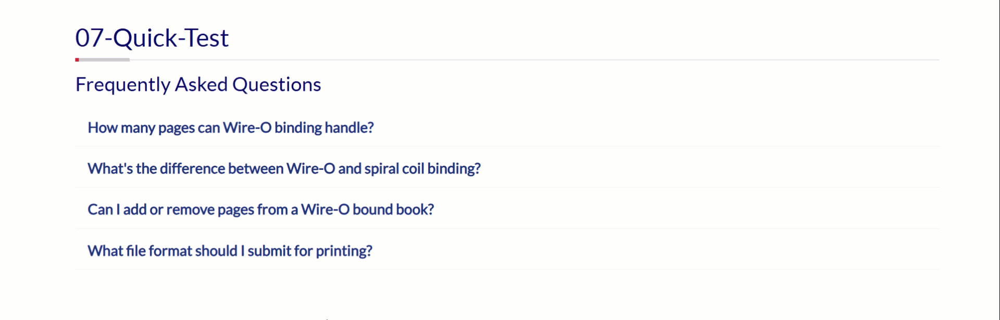

# Component: FAQ Accordion


*(Note: You will need to create and upload a screenshot named `01-faq-formatting.gif` for this preview to appear.)*

This component is a responsive and accessible accordion section for displaying a list of frequently asked questions.

---

### Requirements

This component is not standalone. It requires the following from the main project environment to function correctly:
- Bootstrap 4.6 (for the collapse functionality and styling).
- The Global Custom Styles.

For details, please refer to the **main project `README.md` file**.

---

### How to Use

1.  **Copy the Code:** Copy the entire HTML content from the `01-faq-formatting.html` file.
2.  **Place in Template:** Paste the code into the main content area of one of the shell templates (like the `011-Hero-Sticky-Nav` template).
3.  **Customize the Content:**
    *   Change the main `<h2>` heading (e.g., "Frequently Asked Questions").
    *   For each question, edit the text inside the `<button>` tag.
    *   For each answer, edit the content inside the `<div class="faq-body">`. You can include paragraphs, lists, and links in the answer.

----
### ⚠️ IMPORTANT: What NOT to Change

For the accordion to work properly, **DO NOT modify** the following:

1. **Class names** - Keep all classes as they are (e.g., `accordion`, `card`, `card-header`, `collapse`, `faq-body`)
2. **IDs** - These MUST match:
   - The main accordion ID: `id="faqAccordion"`
   - Each question's header ID: `id="faq1"`, `id="faq2"`, etc.
   - Each answer's collapse ID: `id="collapse1"`, `id="collapse2"`, etc.
3. **Bootstrap attributes**:
   - `data-toggle="collapse"`
   - `data-target="#collapse1"` (must match the collapse ID)
   - `data-parent="#faqAccordion"` (must match the main accordion ID)

**When adding more questions:**
- Copy the entire card block
- Increment the numbers in IDs: `faq2`, `collapse2`, `faq3`, `collapse3`, etc.
- Make sure `data-target` matches the new `collapse` ID

**Only change:**
- The heading text inside `<h2>`
- The question text inside `<button>`
- The answer content inside `<div class="faq-body">`


----


### Code Structure Example

The component uses a standard Bootstrap 4 accordion structure. Each question/answer pair is a `<div class="card">`.

```html
<!-- The main container for the entire FAQ section -->
<section id="faq-section" class="mb-5 pb-4">
  <h2 class="mb-3">Frequently Asked Questions</h2>

  <!-- This ID is important for the parent attribute -->
  <div class="accordion" id="faqAccordion">

    <!-- START: A Single Question/Answer Card -->
    <div class="card">
      <div class="card-header" id="faq1">
        <h3 class="h5 mb-0">
          <button class="faq-toggle collapsed" type="button" data-toggle="collapse" data-target="#collapse1">
            <!-- Your Question Goes Here -->
            How many pages can Wire-O binding handle?
            <span class="faq-icon"><i class="bi bi-chevron-down"></i></span>
          </button>
        </h3>
      </div>

      <div id="collapse1" class="collapse" data-parent="#faqAccordion">
        <div class="faq-content">
          <div class="faq-body">
            <!-- Your Answer Goes Here -->
            <p>
              Wire-O binding can typically accommodate between 20 and 250 sheets...
            </p>
          </div>
        </div>
      </div>
    </div>
    <!-- END: A Single Question/Answer Card -->

    <!-- Add more <div class="card"> blocks here for more questions -->

  </div>
</section>
