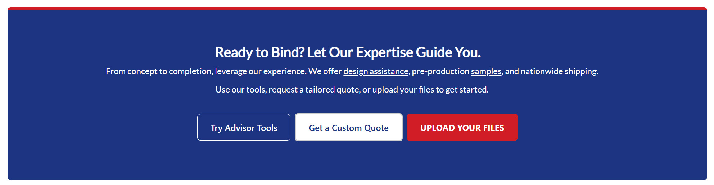
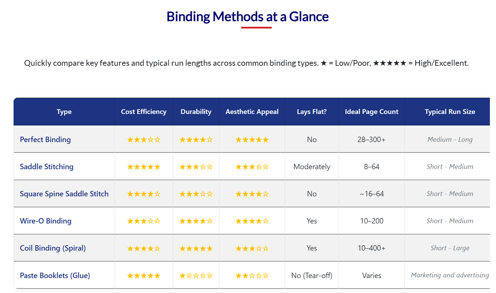
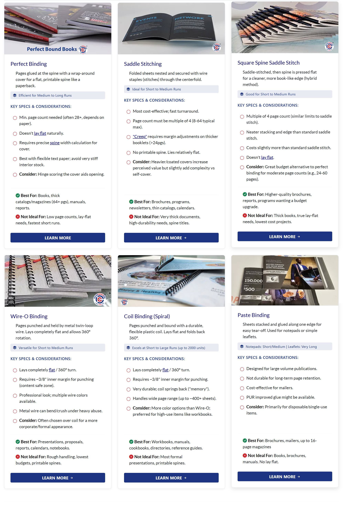
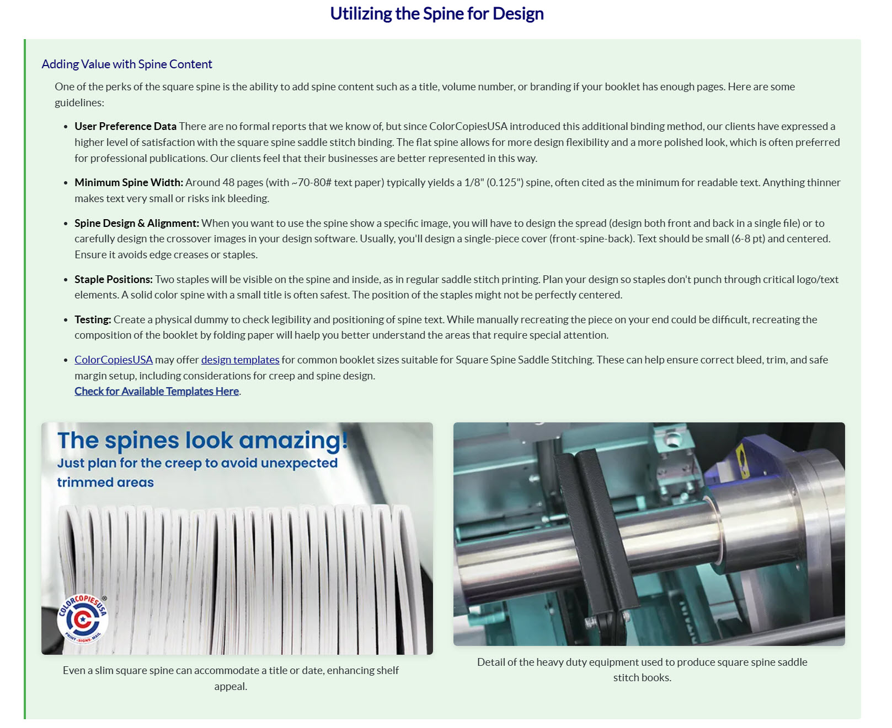

# Pillar Page Content Snippets

This folder contains a collection of advanced content blocks (like comparison tables, feature cards, CTAs, etc.) that were originally designed for a pillar page.

## VERY IMPORTANT: How to Use These Snippets

These snippets are **NOT standalone**. They are just the HTML structure and will not look correct on their own.

They **MUST** be placed inside the **`011-Hero+stickyTOC+FAQ+other-bottom-content.html`** template. That template file contains the necessary CSS `<style>` block that makes all of these snippets render correctly.

## Available Snippets

This is a visual guide to the reusable blocks available in the `/_snippets` subfolder.
| Preview | Snippet Name | Description |
| :--- | :--- | :--- |
|  | [final cta 3 buttons](./_snippets/final-cta-3-buttons.html) | A full-width, blue-background call-to-action section with multiple buttons. |
|  | [Table-7-rows-7cols.html](./_snippets/Table-7-rows-7cols.html) | A responsive table for comparing features across different items, with a star rating system. |
| | [snippet-binding-cards.html](./_snippets/snippet-binding-method-cards.html)|6 cards with image, title and specs for pillar page |
| | [Card-light-green-2-images.html](./_snippets/Card-light-green-2-images.html)|Light Green Block with two pictures |

