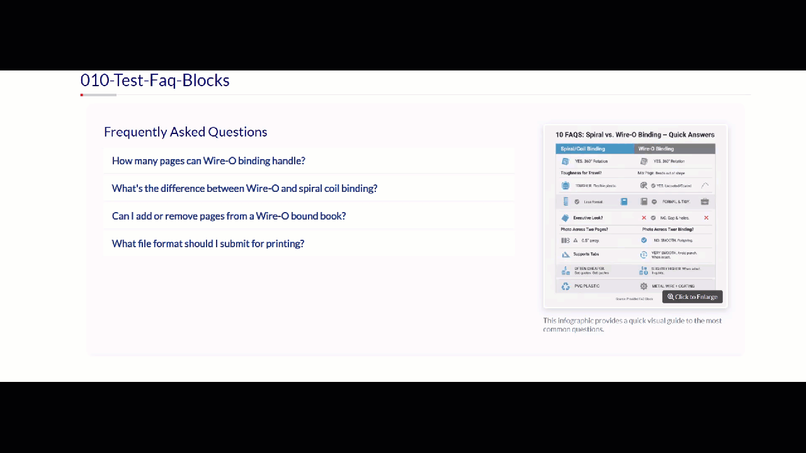

# Component: FAQ with Infographic



This component displays a list of frequently asked questions in an accordion, paired with a visual infographic in a responsive, two-column layout. It is semantically structured to connect the image to the text for accessibility and SEO.

---

### Requirements

This component is not standalone. It requires the following from the main project environment to function correctly:
- Bootstrap 4.6 (for the grid, collapse functionality, and styling).
- The Global Custom Styles.

For details, please refer to the **main project `README.md` file**.

---

### How to Use

1.  **Copy the Code:** Copy the entire HTML content from the `faq-with-infographic.html` file.
2.  **Place in Template:** Paste the code into the main content area of a shell template.
3.  **Customize the Content:**
    *   **Replace the Infographic:** Update the `src` attribute of the `` tag with the URL for your new infographic. Also, update the `alt` text to be descriptive.
    *   **Update the Caption:** Change the text inside the `<figcaption>` to provide context for your specific infographic.
    *   **Update the Accordion:** Edit the questions and answers in the accordion cards just as you would with the standard FAQ component.

### Code Structure Example

The component uses a Bootstrap 4 row with two columns. On mobile, the infographic column (`order-lg-2`) will stack *below* the accordion column (`order-lg-1`).

```html
<section id="faq-section-infographic" class="mb-5 pb-4">
  <div class="container">
    <div class="row align-items-center">

      <!-- Column 1: Accordion (Order set for mobile stacking) -->
      <div class="col-lg-7 order-lg-1">
        <h2 class="mb-3" aria-describedby="faq-infographic-figure">Frequently Asked Questions</h2>
        <div class="accordion" id="faqAccordionInfographic">
          <!-- FAQ cards go here... -->
        </div>
      </div>

      <!-- Column 2: Infographic (Order set for mobile stacking) -->
      <div class="col-lg-5 mb-4 mb-lg-0 order-lg-2">
        <figure id="faq-infographic-figure">
          
          <figcaption>This is the caption for the infographic.</figcaption>
        </figure>
      </div>
      
    </div>
  </div>
</section>
