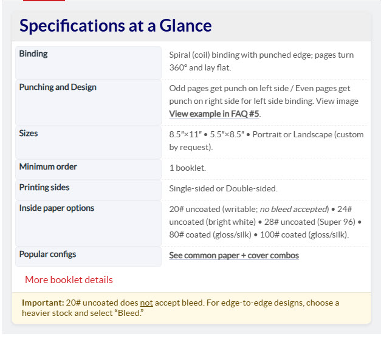
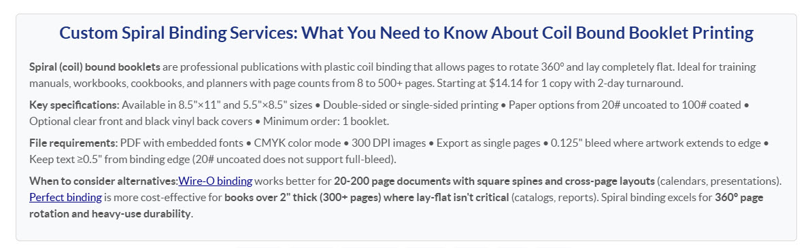
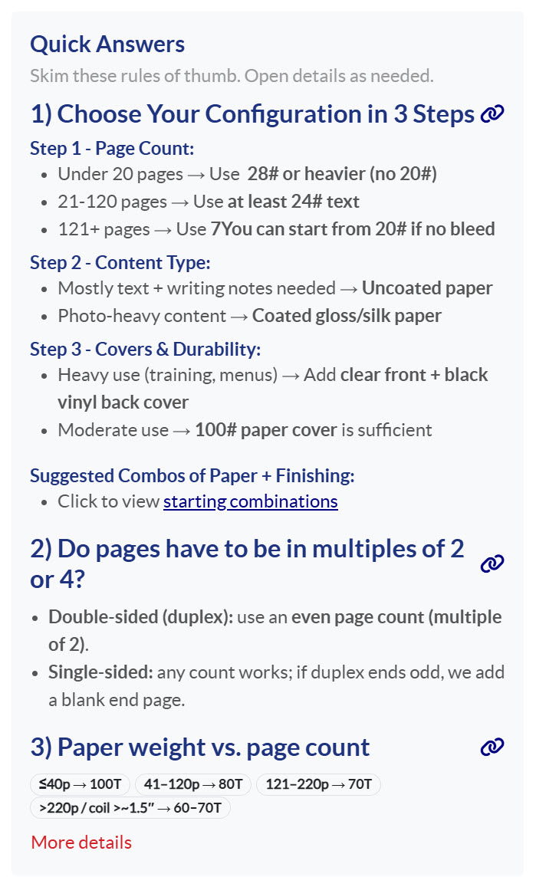
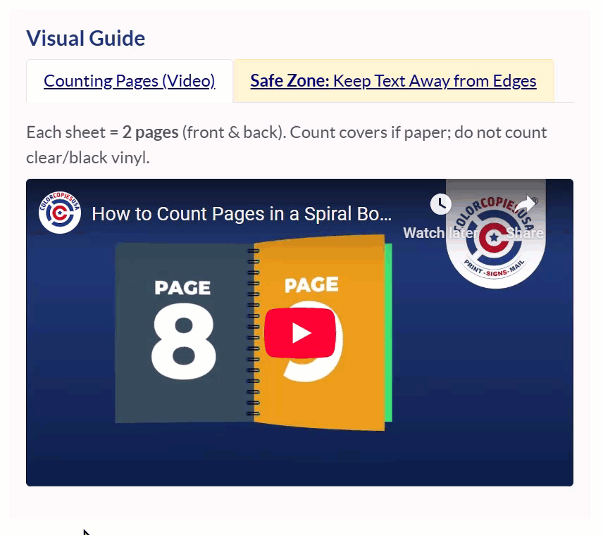
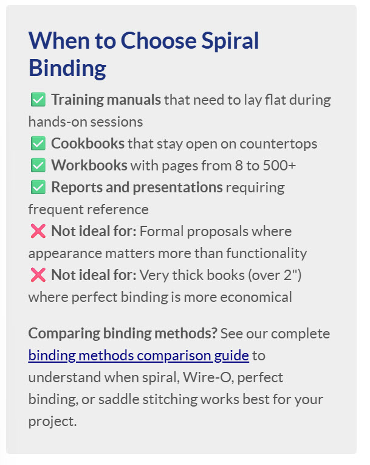
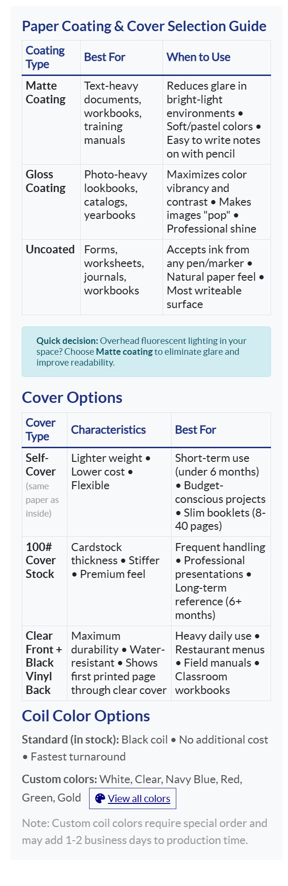
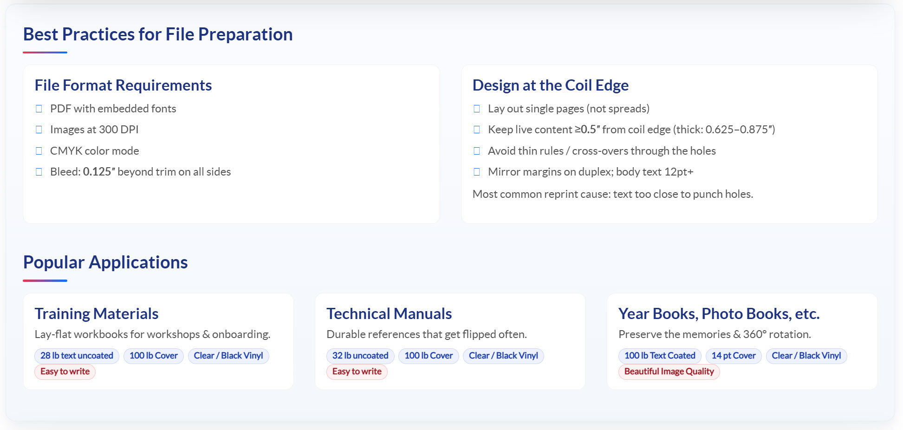
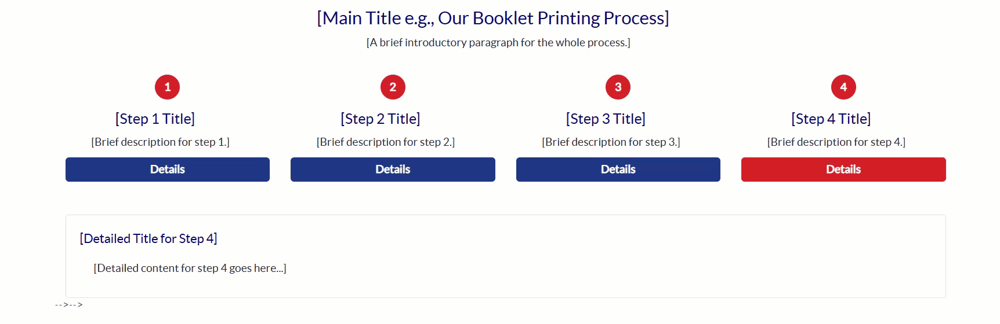

# Collection: Product Page Components

This folder contains a collection of reusable HTML snippets specifically designed for building the body of our product pages.

These components are designed to be placed inside one of the main page templates (like the "Hero + Sticky Nav" shell) and rely on the Global Custom Styles to render correctly.

---

## Available Snippets

This is a visual guide to the reusable blocks available in the `/_snippets` subfolder.

| Preview | Snippet Name (Click to View Code) | Description |
| :--- | :--- | :--- |
|  | [`snippet-specifications-table.html`](./_snippets/snippet-specifications-table.html) | A structured, two-column table for displaying key product features and specifications. This is intended for the `DESCRIPTION 1` area of a product page. |
|  | [`snippet-intro-summary.html`](./_snippets/snippet-intro-summary.html) | A detailed introduction block with a lead paragraph, key specifications, file requirements, and links to alternative products. |
|  | [`snippet-quick-answers.html`](./_snippets/snippet-quick-answers.html) | An interactive, collapsible block that shows key points upfront and reveals more details when a "More details" button is clicked. |
|  | [`snippet-visual-guide-tabs.html`](./_snippets/snippet-visual-guide-tabs.html) | An interactive component with two tabs for displaying a video and image examples. Includes a self-contained style for a yellow "attention" tab. |
|  | [`snippet-best-for-checklist.html`](./_snippets/snippet-best-for-checklist.html) | A scannable checklist of "ideal for" and "not ideal for" use cases for a product, with a link to a comparison guide. |
|  | [`snippet-selection-guide-tables.html`](./_snippets/snippet-selection-guide-tables.html) | A detailed guide component with multiple tables and sections for helping users choose product options (e.g., coating, covers). |
|  | [`snippet-best-practices-and-apps.html`](./_snippets/snippet-best-practices-and-apps.html) | A two-part component with styled cards for "Best Practices" and "Popular Applications," featuring tag-like "chips." Self-contained with its own CSS. |
|  | [`snippet-process-steps-interactive.html`](./_snippets/snippet-process-steps-interactive.html) | A 4-step interactive timeline that reveals detailed content for each step. Self-contained with its own CSS and JS. |
