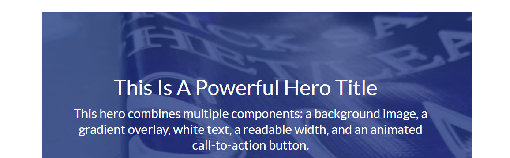
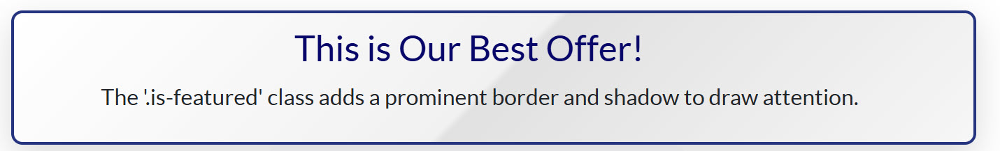
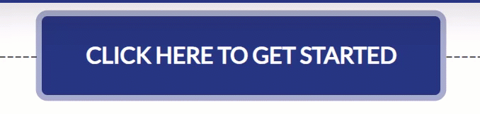
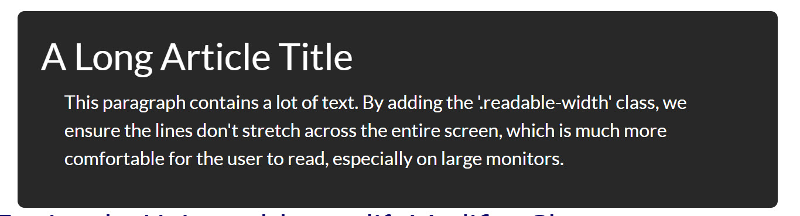
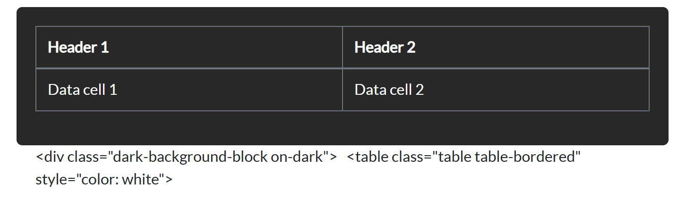
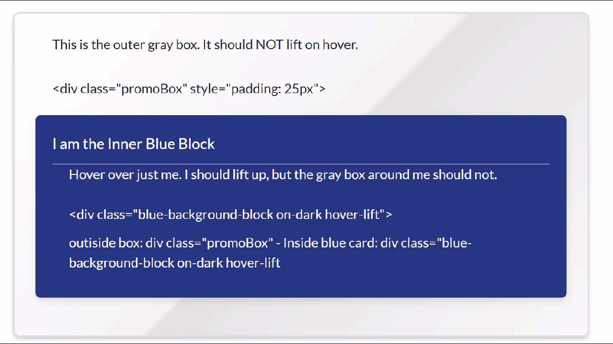
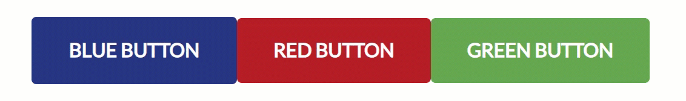
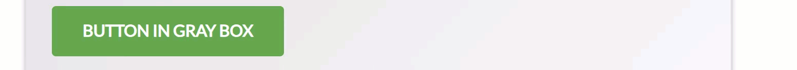
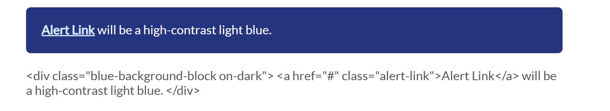

# Brand Style Guide

This document defines the official color palette for all components in this library. Since the target CMS environment does not support CSS variables, **always use the direct Hex Codes** provided below to ensure brand consistency.

---

## Primary Corporate Colors

These are the main colors that define our brand identity.

| Color | Swatch | Hex Code | Usage |
| :--- | :---: | :--- | :--- |
| **Corporate Blue** |  | `#1c3481` | Primary headings, primary buttons, important links, and accents. |
| **Corporate Red** |  | `#d01e25` | Call-to-action buttons, interactive links, and highlights. |

---

## Secondary & Accent Colors

These colors are used for backgrounds, borders, and text to support the primary palette.

| Color | Swatch | Hex Code | Usage |
| :--- | :---: | :--- | :--- |
| **Light Blue** |  | `#E8F4FD` | Calculator / Forms / Light backgrounds for info boxes and subtle highlights. |
| **Light Grey** |  | `#f8f9fa` | Default background color for sections to create visual separation. |
| **Darker Blue** |  | `#162965` | Hover state for primary blue buttons and elements. |
| **Charcoal Gray** |  | `#34495E` | Hover state for primary blue buttons and elements. |
| **Professional Blue** |  | `#4A90C2` | helpful information and tips blocks. |

---

## Text & Border Colors

These are the standard colors for typography and UI elements.

| Color | Swatch | Hex Code | Usage |
| :--- | :---: | :--- | :--- |
| **Dark Text** |  | `#343a40` | Main body copy and paragraph text. |
| **Grey Text** |  | `#6c757d` | Subheadings, meta-data, and less important text. |
| **Grey Border** |  | `#dee2e6` | Standard borders for cards, tables, and dividers. |


## Text Link Styles

This section defines the standard appearance for text links (`<a>` tags) and their special variations.

### Standard Links (on Light Backgrounds)

This is the default style for all links on white or light grey backgrounds.

| State | Color | Swatch | Hex Code | Notes |
| :--- | :--- | :--- | :--- | :--- |
| **Default** | Corporate Red |  | `#d01e25` | All standard links should use the primary red color. |
| **Hover** | Darker Red |  | `#a8181e` | Links should darken and become underlined on hover. |

### Standard Context (on Light Backgrounds)

This is the default style for all content placed on a white or light grey background.

| Element | Style | Example |
| :--- | :--- | :--- |
| **Headings & Text** | Dark Text (`#343a40`) | Normal paragraph and heading color. |
| **Standard Link** | Corporate Red (`#d01e25`) | `<a>` tags are red by default. |
| **Link Hover** | Darker Red (`#a8181e`) | Links darken and are underlined on hover. |

---
---

## 3. Global CSS Components & Effects

This section documents the special global CSS classes that can be applied to elements to add visual styles and effects. For a live demonstration of all these classes working together, see the file in the `_demonstrations` folder.
                                                                                        
                                                                                                                                        ---

## 3. Global CSS Components & Effects

This section documents the special global CSS classes that can be applied to elements to add visual styles and effects. For a live demonstration of all these classes working together, see the file in the `_demonstrations` folder.

### Summary Table

| Component / Effect | Context | Key CSS Classes | Preview |
| :--- | :--- | :--- | :--- |
| **White Fonts on Dark BG (Hero)** | Hero Section | `` `.hero-block` ``, `` `.on-dark` `` |  |
| **Pulsing Red Button** | On Hero / Dark BG | `` `.custom-red-button` ``, `` `.animate-pulse` `` |  |
| **Featured Promo Box** | Message Block | `` `.promoBox` ``, `` `.is-featured` `` |  |
| **Pulsing Blue Button** | On Light BG | `` `.custom-blue-button` ``, `` `.animate-pulse` `` |  |
| **Readable Width Text** | Inside Dark Block | `` `.readable-width` `` |  |
| **Table on Dark BG** | Inside Dark Block | `` `.on-dark` ``, `style="color: white"` |  |
| **Nested Hover/Lift Box** | Nesting Blocks | `` `.hover-lift` `` |  |
| **Standard Buttons** | Any | `` `.custom-blue-button` ``, etc. |  |
| **Nested Green Button** | Button in Box | `` `.promoBox` ``, `` `.custom-green-button` `` |  |
| **Alert Link** | Dark BG Only | `` `.alert-link` `` |  |

---

### Code Examples

#### 1. White Fonts on Dark Background (Hero)
Use `.hero-block` and `.on-dark` to create a hero with white text.

```html
<div class="hero-block on-dark readable-width" style="--hero-bg-image: url('...');">
  <h1>This text will be white.</h1>
</div>```

#### 2. Pulsing Red Button
Add `.animate-pulse` to a `.custom-red-button` to make it pulse.

```html
<a href="#" class="custom-red-button animate-pulse" style="margin-top: 20px;">
  A Pulsing Button
</a>             
                                                                                                                                                                                                                                                                                                                  
   
