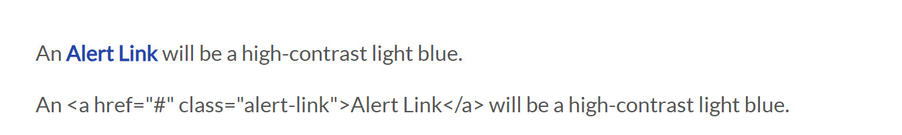
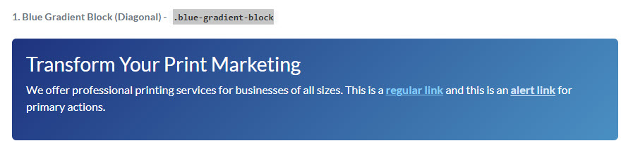
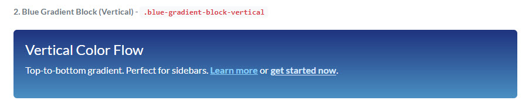
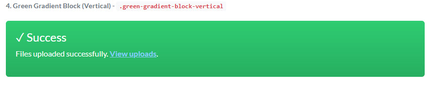
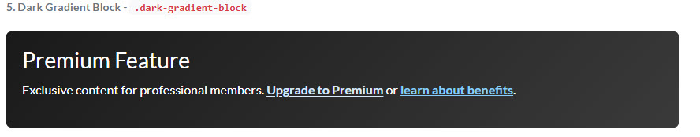
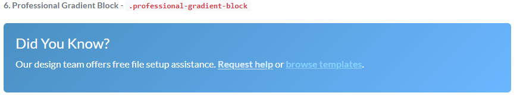
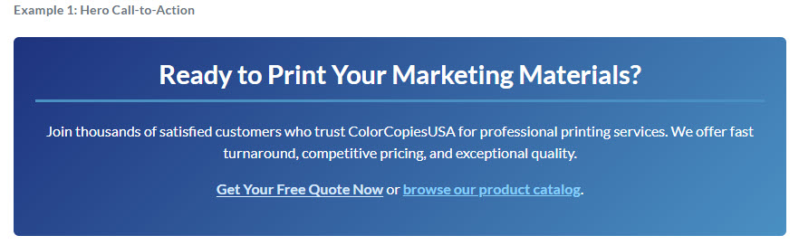
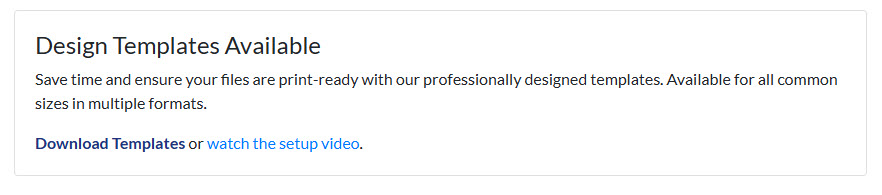

# Brand Style Guide

This document defines the official color palette for all components in this library. Since the target CMS environment does not support CSS variables, **always use the direct Hex Codes** provided below to ensure brand consistency.

---

## Primary Corporate Colors

These are the main colors that define our brand identity.

| Color | Swatch | Hex Code | Usage |
| :--- | :---: | :--- | :--- |
| **Corporate Blue** |  | `#1c3481` | Primary headings, primary buttons, important links, and accents. |
| **Corporate Red** |  | `#d01e25` | Call-to-action buttons, interactive links, and highlights. |

---

## Secondary & Accent Colors

These colors are used for backgrounds, borders, and text to support the primary palette.

| Color | Swatch | Hex Code | Usage |
| :--- | :---: | :--- | :--- |
| **Light Blue** |  | `#E8F4FD` | Calculator / Forms / Light backgrounds for info boxes and subtle highlights. |
| **Light Grey** |  | `#f8f9fa` | Default background color for sections to create visual separation. |
| **Darker Blue** |  | `#162965` | Hover state for primary blue buttons and elements. |
| **Charcoal Gray** |  | `#34495E` | Hover state for primary blue buttons and elements. |
| **Professional Blue** |  | `#4A90C2` | helpful information and tips blocks. |

---

## Text & Border Colors

These are the standard colors for typography and UI elements.

| Color | Swatch | Hex Code | Usage |
| :--- | :---: | :--- | :--- |
| **Dark Text** |  | `#343a40` | Main body copy and paragraph text. |
| **Grey Text** |  | `#6c757d` | Subheadings, meta-data, and less important text. |
| **Grey Border** |  | `#dee2e6` | Standard borders for cards, tables, and dividers. |


## Text Link Styles

This section defines the standard appearance for text links (`<a>` tags) and their special variations.

### Standard Links (on Light Backgrounds)

This is the default style for all links on white or light grey backgrounds.

| State | Color | Swatch | Hex Code | Notes |
| :--- | :--- | :--- | :--- | :--- |
| **Default** | Corporate Red |  | `#d01e25` | All standard links should use the primary red color. |
| **Hover** | Darker Red |  | `#a8181e` | Links should darken and become underlined on hover. |

### Standard Context (on Light Backgrounds)

This is the default style for all content placed on a white or light grey background.

| Element | Style | Example |
| :--- | :--- | :--- |
| **Headings & Text** | Dark Text (`#343a40`) | Normal paragraph and heading color. |
| **Standard Link** | Corporate Red (`#d01e25`) | `<a>` tags are red by default. |
| **Link Hover** | Darker Red (`#a8181e`) | Links darken and are underlined on hover. |

---
---


## 3. Global CSS Components & Effects

This section documents the special global CSS classes that can be applied to elements to add visual styles and effects. For a live demonstration of all these classes working together, see the file in the `_demonstrations` folder.

### Summary Table

| # | Component / Effect | Best For | Key CSS Classes | Preview |
| :---: | :--- | :--- | :--- | :--- |
| **1** | White Fonts on Dark BG (Hero) | Hero sections, dark backgrounds | `.hero-block`, `.on-dark` |   |
| **2** | Pulsing Red Button | CTAs on dark backgrounds | `.custom-red-button`, `.animate-pulse` |  |
| **3** | Featured Promo Box | Important announcements, promotions | `.promoBox`, `.is-featured` |  |
| **4** | Pulsing Blue Button | CTAs on light backgrounds | `.custom-blue-button`, `.animate-pulse` |  |
| **5** | Readable Width Text | Inside dark blocks for better readability | `.readable-width` |  |
| **6** | Table on Dark BG | Data tables on dark backgrounds | `.on-dark`, `style="color: white"` |  |
| **7** | Nested Hover/Lift Box | Interactive cards, promotional boxes | `.hover-lift` |  |
| **8** | Standard Buttons | Any context, primary actions | `.custom-blue-button`, `.custom-red-button`, `.custom-green-button` |  |
| **9** | Nested Green Button | CTAs inside promotional boxes | `.promoBox`, `.custom-green-button` |  |
| **10** | Alert Link (Dark Background) | High-priority links on dark backgrounds | `.alert-link`, `.on-dark` |  |
| **11** | Alert Link (White Background) | Emphasis links on light backgrounds | `.alert-link` |  |
| **12** | Blue Gradient (Diagonal) | Hero sections, main callouts | `.blue-gradient-block`, `.on-dark` |  |
| **13** | Blue Gradient (Vertical) | Sidebars, vertical banners | `.blue-gradient-block-vertical`, `.on-dark` |  |
| **14** | Green Gradient (Diagonal) | Success messages, confirmations | `.green-gradient-block`, `.on-dark` |  |
| **15** | Green Gradient (Vertical) | Vertical success indicators | `.green-gradient-block-vertical`, `.on-dark` |  |
| **16** | Dark Gradient | Premium features, sophisticated content | `.dark-gradient-block`, `.on-dark` |  |
| **17** | Professional Gradient | Subtle info boxes, secondary callouts | `.professional-gradient-block`, `.on-dark` |  |
| **18** | Hero Call-to-Action | Main CTAs with multiple elements | `.blue-gradient-block`, `.on-dark`, `.text-center` |  |
| **19** | Informational Card (White) | Content cards with emphasis links | `.card`, `.card-body`, `.alert-link` |  |

-------------------------------------


| Component / Effect | Context | Key CSS Classes | Preview |
| :--- | :--- | :--- | :--- |
| **White Fonts on Dark BG (Hero)** | Hero Section | `` `.hero-block` ``, `` `.on-dark` `` |  |
| **Pulsing Red Button** | On Hero / Dark BG | `` `.custom-red-button` ``, `` `.animate-pulse` `` |  |
| **Featured Promo Box** | Message Block | `` `.promoBox` ``, `` `.is-featured` `` |  |
| **Pulsing Blue Button** | On Light BG | `` `.custom-blue-button` ``, `` `.animate-pulse` `` |  |
| **Readable Width Text** | Inside Dark Block | `` `.readable-width` `` |  |
| **Table on Dark BG** | Inside Dark Block | `` `.on-dark` ``, `style="color: white"` |  |
| **Nested Hover/Lift Box** | Nesting Blocks | `` `.hover-lift` `` |  |
| **Standard Buttons** | Any | `` `.custom-blue-button` ``, etc. |  |
| **Nested Green Button** | Button in Box | `` `.promoBox` ``, `` `.custom-green-button` `` |  |
| **Alert Link** | Dark BG Only | `` `.alert-link` `` |  |
| **Alert Link on white bkg** | on White Option | `` `.alert-link` `` |  |
| **Blue Gradient Block (Diagonal)** | Hero / Intro Section | `` `.blue-gradient-block` ``, `` `.on-dark` `` |  |
| **Blue Gradient Block (Vertical)** | Sidebar / Vertical Banner | `` `.blue-gradient-block-vertical` ``, `` `.on-dark` `` |  |
| **Green Gradient Block (Diagonal)** | Success / Confirmation | `` `.green-gradient-block` ``, `` `.on-dark` `` |  |
| **Green Gradient Block (Vertical)** | Sidebar Success Message | `` `.green-gradient-block-vertical` ``, `` `.on-dark` `` |  |
| **Dark Gradient Block** | Premium / Sophisticated | `` `.dark-gradient-block` ``, `` `.on-dark` `` |  |
| **Professional Gradient Block** | Subtle Info / Secondary | `` `.professional-gradient-block` ``, `` `.on-dark` `` |  |
| **Hero Call-to-Action** | Main CTA Section | `` `.blue-gradient-block` ``, `` `.on-dark` ``, `` `.text-center` ``, `` `.alert-link` `` |  |
| **Informational Card (White)** | Standard Content Card | `` `.card` ``, `` `.card-body` ``, `` `.alert-link` `` |  |

---

### Code Examples ###

```

#### 1. White Fonts on Dark Background (Hero)
Use `.hero-block` and `.on-dark` to create a hero with white text.

```html
<div class="hero-block on-dark readable-width" style="--hero-bg-image: url('...');">
  <h1>This text will be white.</h1>
</div>```

#### 2. Pulsing Red Button
Add `.animate-pulse` to a `.custom-red-button` to make it pulse.

```html
<a href="#" class="custom-red-button animate-pulse" style="margin-top: 20px;">
  A Pulsing Button
</a>             

#### 3. Featured Promo Box
Use .promoBox.is-featured to create a white card with a blue outline and shadow.

```html
<div class="promoBox is-featured" style="text-align: center;">
  <p>This is a featured promotional box.</p>
</div>

#### 4. Pulsing Blue Button
Add .animate-pulse to a .custom-blue-button.

```html
<a href="#" class="custom-blue-button animate-pulse">A Pulsing Blue Button</a>

#### 5. Readable Width Text
Add .readable-width to a container to constrain the width of the text inside for better readability.

```html
<div class="dark-background-block on-dark readable-width">
  <p>This line of text will not stretch across the entire screen, making it much easier to read.</p>
</div>

#### 6. Table on Dark Background
Place a standard table inside an .on-dark container. You must also add an inline style color: white to the table itself to force the text to be white.

```html
<div class="dark-background-block on-dark">
  <table class="table table-bordered" style="color: white;">
    <!-- table content -->
  </table>
</div>


#### 7. Nested Hover/Lift Box
Add the .hover-lift class to a block to make it lift on hover. The CSS will handle nested effects correctly.

```html
<div class="promoBox">
  <div class="blue-background-block on-dark hover-lift">
    <p>This blue box will lift on hover, even though it is inside another container.</p>
  </div>
</div>


#### 8.Standard Buttons
Use these classes for consistently styled buttons. They will have built-in hover effects.

```html
<a href="#" class="custom-blue-button">Blue Button</a>
<a href="#" class="custom-red-button">Red Button</a>
<a href="#" class="custom-green-button">Green Button</a>


#### 9. Nested Green Button
Placing a button inside another block like a .promoBox works automatically.

```html
<div class="promoBox" style="padding: 25px;">
  <a href="#" class="custom-green-button">A Green Button</a>
</div>


#### 10. Alert Link
Use the .alert-link class on an <a> tag only when it is inside an .on-dark container to create a high-contrast link. It will appear light-blue/white underlined.
Class .alert-link on white background (without the background-block on-dark will look like  a "professional blue" with no underlining

```html
<div class="blue-background-block on-dark">
  This is a sentence with a special <a href="#" class="alert-link">Alert Link</a>.
</div>

#### 11. Alert Link on white bkg
The same class looks differently under white background (when no dark-background classes are applied) producing a professional blue no-underline bold link. nice lookng

```html
  This is a sentence with a special <a href="#" class="alert-link">Alert Link</a>.
</div>


#### 12. Blue Gradient Block (Diagonal)
Use `.blue-gradient-block` with `.on-dark` to create a diagonal blue gradient background. Perfect for hero sections and important callouts.

```html
<div class="blue-gradient-block on-dark">
  <div class="p-3">
    <h3>Transform Your Print Marketing</h3>
    <p>We offer professional printing services for businesses of all sizes. 
       This is a <a href="#">regular link</a> and this is an 
       <a href="#" class="alert-link">alert link</a> for primary actions.</p>
  </div>
</div>
```

#### 13. Blue Gradient Block (Vertical)
Use `.blue-gradient-block-vertical` for a top-to-bottom gradient flow. Ideal for sidebars and vertical banners.

```html
<div class="blue-gradient-block-vertical on-dark">
  <h4>Vertical Color Flow</h4>
  <p>Perfect for sidebars. <a href="#">Learn more</a> or 
     <a href="#" class="alert-link">get started now</a>.</p>
</div>
```

#### 14. Green Gradient Block (Diagonal)
Use `.green-gradient-block` with `.on-dark` for success messages, confirmations, and positive outcomes.

```html
<div class="green-gradient-block on-dark">
  <h3>✓ Order Confirmed!</h3>
  <p>Your order has been successfully processed. 
     <a href="#" class="alert-link">Track your order</a> or 
     <a href="#">view order details</a>.</p>
</div>
```

#### 15. Green Gradient Block (Vertical)
Use `.green-gradient-block-vertical` for vertical success indicators and sidebar confirmations.

```html
<div class="green-gradient-block-vertical on-dark">
  <h4>✓ Success</h4>
  <p>Files uploaded successfully. <a href="#">View uploads</a>.</p>
</div>
```

#### 16. Dark Gradient Block
Use `.dark-gradient-block` with `.on-dark` for premium features and sophisticated content sections.

```html
<div class="dark-gradient-block on-dark">
  <h3>Premium Feature</h3>
  <p>Exclusive content for professional members. 
     <a href="#" class="alert-link">Upgrade to Premium</a> or 
     <a href="#">learn about benefits</a>.</p>
</div>
```

#### 17. Professional Gradient Block
Use `.professional-gradient-block` with `.on-dark` for subtle backgrounds and secondary callouts. This lighter blue gradient is perfect for informational sections.

```html
<div class="professional-gradient-block on-dark">
  <h4>Did You Know?</h4>
  <p>Our design team offers free file setup assistance. 
     <a href="#" class="alert-link">Request help</a> or 
     <a href="#">browse templates</a>.</p>
</div>
```

#### 18. Hero Call-to-Action (Complex Example)
Combine `.blue-gradient-block`, `.on-dark`, and Bootstrap utilities for a centered hero section with alert links.

```html
<div class="blue-gradient-block on-dark text-center p-4">
  <h2>Ready to Print Your Marketing Materials?</h2>
  <p class="mb-3">Join thousands of satisfied customers who trust ColorCopiesUSA 
     for professional printing services. We offer fast turnaround, competitive 
     pricing, and exceptional quality.</p>
  <p><a href="#" class="alert-link">Get Your Free Quote Now</a> or 
     <a href="#">browse our product catalog</a>.</p>
</div>
```

#### 19. Informational Card (White Background)
Use Bootstrap's `.card` component with `.alert-link` for professional emphasis on white backgrounds.

```html
<article class="card">
  <div class="card-body">
    <h4>Design Templates Available</h4>
    <p>Save time and ensure your files are print-ready with our professionally 
       designed templates. Available for all common sizes in multiple formats.</p>
    <p class="mb-0"><a href="#" class="alert-link">Download Templates</a> or 
       <a href="#">watch the setup video</a>.</p>
  </div>
</article>
```


---
## SECTION 4: ADD USAGE NOTES
---
Copy this entire section and paste after all code examples (after "#### 19"):

---

### Important: Using Gradient Blocks

**CRITICAL:** Gradient blocks MUST be used with the `.on-dark` class for text to be readable. Never use a gradient block without `.on-dark`.

**Correct Usage:**
```html
<div class="blue-gradient-block on-dark">
  <p>Text is white and readable</p>
</div>
```

**Incorrect Usage (Text will be unreadable):**
```html
<div class="blue-gradient-block">
  <p>Text will be dark on dark background!</p>
</div>
```

**When to Use Each Gradient:**

| Gradient Class | Use For | Direction |
| :--- | :--- | :--- |
| `.blue-gradient-block` | Hero sections, main callouts, important announcements | Diagonal (135°) |
| `.blue-gradient-block-vertical` | Sidebars, vertical banners | Vertical (top→bottom) |
| `.green-gradient-block` | Success messages, confirmations, positive outcomes | Diagonal (135°) |
| `.green-gradient-block-vertical` | Vertical success indicators | Vertical (top→bottom) |
| `.dark-gradient-block` | Premium features, sophisticated content | Diagonal (135°) |
| `.professional-gradient-block` | Subtle info boxes, secondary callouts | Diagonal (135°) |

**Best Practices:**
- Use 1-2 gradients per page maximum (e.g., hero intro + closing CTA)
- Always pair gradient blocks with `.on-dark`
- Use `.alert-link` for 1-2 primary CTAs per gradient section
- Combine with Bootstrap utilities (`.text-center`, `.p-4`, etc.) for layout

---

### Quick Reference for Developers

```html
<!-- Blue gradient hero -->
<div class="blue-gradient-block on-dark text-center p-4">
  <h2>Heading</h2>
  <p><a href="#" class="alert-link">Primary CTA</a></p>
</div>

<!-- Green gradient success -->
<div class="green-gradient-block on-dark p-4">
  <h3>✓ Success</h3>
  <p><a href="#" class="alert-link">Next Step</a></p>
</div>

<!-- White card with emphasis link -->
<article class="card">
  <div class="card-body">
    <h4>Title</h4>
    <p><a href="#" class="alert-link">Primary Action</a></p>
  </div>
</article>
```
